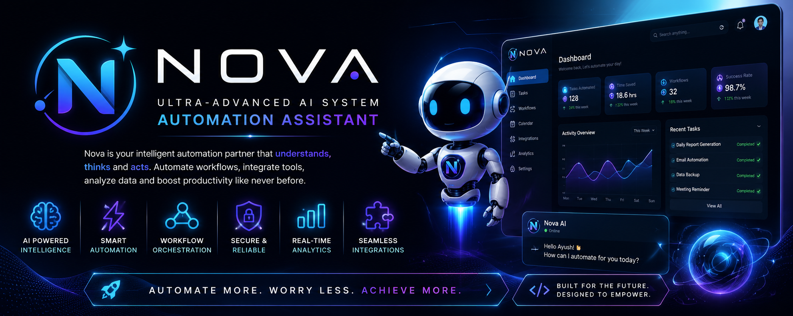

# 🚀 Nova-Ultra-Advanced System Automation Assistant

<p align="center">
  
</p>

<h3 align="center">
✨ An Ultra-Advanced AI System Automation Assistant
</h3>

<p align="center">
Nova is an intelligent AI-powered automation assistant built to simplify complex workflows, automate repetitive tasks, and enhance productivity. It acts as your personal digital assistant, capable of managing tasks, understanding user requests, integrating with external services, and executing automations with minimal human intervention.
</p>

---

# 📖 About Nova

**Nova** is more than just a chatbot.

It is a smart automation platform that combines **Artificial Intelligence**, **workflow automation**, and **real-time integrations** into a single assistant. Whether it's managing files, scheduling tasks, sending notifications, generating content, analyzing data, or connecting with third-party services, Nova performs everything through a clean and intelligent interface.

Designed with scalability in mind, Nova can be extended with APIs, AI agents, cloud services, and custom workflows to automate almost any digital process.

---

# 🖼️ Preview

<p align="center">

</p>

<p align="center">
<i>Nova Dashboard</i>
</p>

---

# ✨ Core Features

* 🤖 AI-Powered Assistant
* ⚡ Intelligent Workflow Automation
* 💬 Natural Language Understanding
* 📅 Smart Task Scheduling
* 📂 File & Document Management
* 🔔 Real-Time Notifications
* 📊 Analytics Dashboard
* 🔐 Secure Authentication
* 🌐 Third-Party API Integration
* 🧠 Context-Aware AI Responses
* ☁️ Cloud Ready
* 📈 Productivity Monitoring

---

# 🧠 How Nova Works

<p align="center">

</p>

```
User Request
      │
      ▼
 Natural Language Processing
      │
      ▼
 AI Decision Engine
      │
      ▼
 Workflow Automation
      │
      ▼
 API / Database / Services
      │
      ▼
 Final Response
```

---

# 🏗️ System Architecture

<p align="center">

</p>

```
Frontend
   │
   ▼
Backend API
   │
   ├──────── Database
   │
   ├──────── AI Engine
   │
   ├──────── Authentication
   │
   └──────── External APIs
```

---

# 🛠 Tech Stack

### Frontend

* React.js
* Tailwind CSS
* TypeScript

### Backend

* Node.js
* Express.js

### Database

* MongoDB

### Artificial Intelligence

* Google Gemini API
* LangChain
* RAG
* Pinecone

### Authentication

* Firebase Auth
* JWT

### Deployment

* Vercel
* Firebase
* Render

---

# 📂 Folder Structure

```
Nova
│
├── client
├── server
├── ai
├── database
├── assets
├── public
├── docs
└── README.md
```

---

# 🚀 Future Vision

Nova aims to become a complete AI automation ecosystem capable of:

* Multi-Agent AI Collaboration
* Voice Assistant
* Email Automation
* WhatsApp Automation
* Calendar Management
* AI Memory
* Smart Recommendations
* IoT Automation
* Business Workflow Automation

---

# 👨‍💻 Developer

**Ayush Kumar**

> *"Automating today to build the intelligent systems of tomorrow."*

---

<p align="center">
⭐ If you like Nova, don't forget to Star this repository!
</p>
